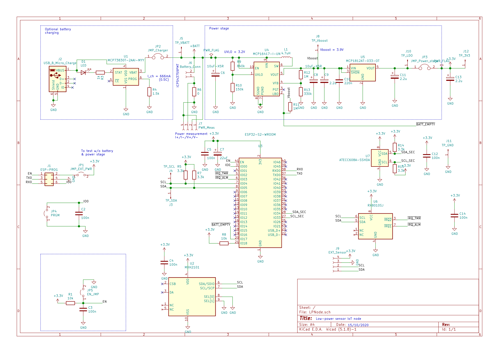

# ESP32x-Epson-RTC-drivers

Epson RTC Drivers for the ESP32 family Combo WiFi/BT Modules.

## How to use the driver

Clone the full directory and copy the examples/rtc_read_time. When creating your project it's important to add the following in the __CMakeLists.txt__ at the project level
``` set(EXTRA_COMPONENT_DIRS component_folder_path) ```. In the ```rtc_read_time``` example, the path is ```../../components```.

You can add the name to a project by changing the following line ```project(rtc_read_time)```.

### I2C Config 

To change the I2C pins and port (e.g. ESP32-S2 has two I2C ports, PORT0 and PORT1) you can use 
```idf.py menuconfig```
and change the pins in ```Component Config->RX8010SJ I2C Setup```.


## Functions documentation

TODO


## LP Node board   

This driver is developed on the LPNode board by Ineltek. In this board the RTC is connected with

I2C Function| PIN
:-----:|:-----:
SDA| GPIO5
SCL| GPIO4

The I2C port used is PORT0.

### Schematics



